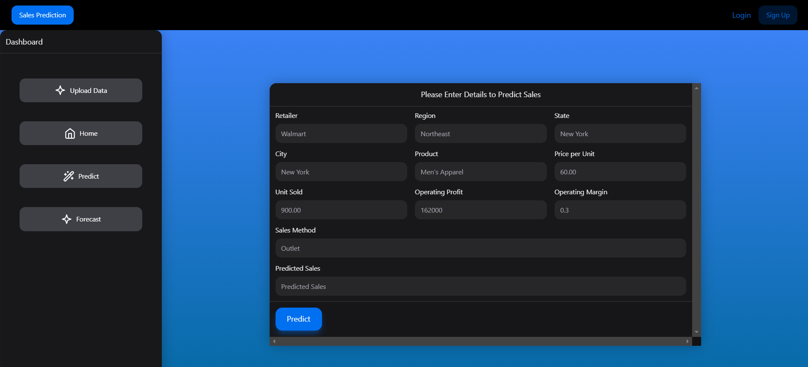
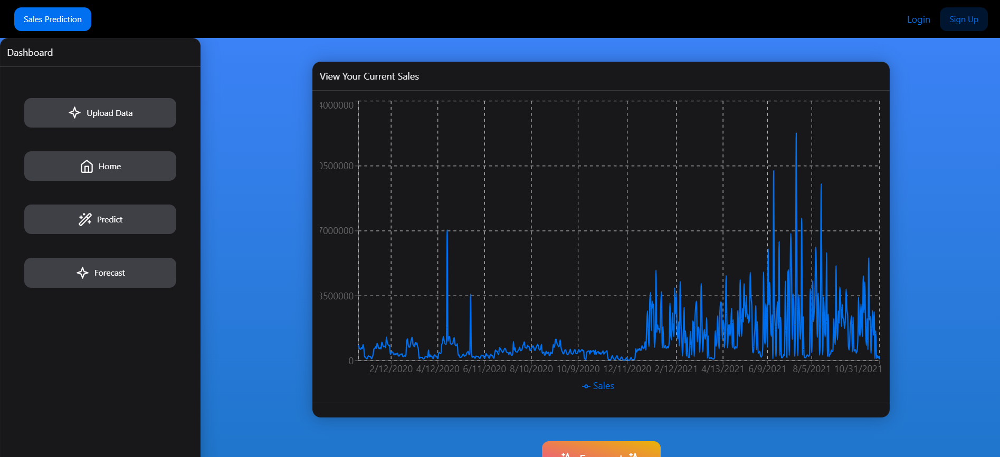

# ForeCast Analytics

Welcome to the ForeCast Analytics Dashboard — a full-stack web application designed to help small and medium businesses gain real-time insights from their sales data. Built with React and Flask, this project integrates machine learning with web technologies to deliver meaningful analytics and sales forecasting.

## Technologies Used

          

## 🚀 Project Overview

This project simulates a client-based engagement for e-commerce business looking to improve their operational strategy. The dashboard allows users to upload historical sales data and receive smart analytics, sales forecasts, and business recommendations.

## 💡 Features

- 📈 **Sales Forecasting:** Uses LSTM neural networks to predict future sales based on trends.
- 🎯 **Predictive Analytics:** Employs XGBoost for product-level sales prediction.
- 🖥️ **Clean UI:** Built with React for a modern and responsive user experience.
- 🔄 **Backend API:** Powered by Flask for handling data processing, model inference, and routing.
- 📊 **Visualization:** Interactive charts to highlight top products, revenue over time, and regional performance (coming soon).

## Screenshots

### Home Page 

### Upload Data 

### Prediction Results 

## Project Status

This project is actively being enhanced with more data visualizations and deployment-ready components.

## Installation

### Prerequisites

- Node.js and npm
- Python 3.7+
- Virtualenv

## Author

Built and maintained by **Hethav**
